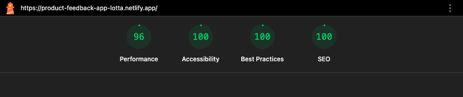
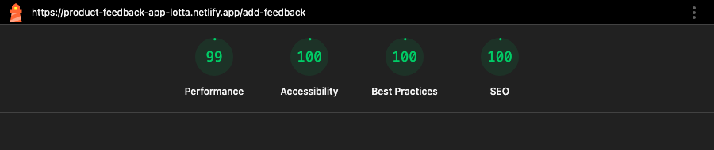

# Product Feedback App

## 📌 Project Description & Purpose

This project is a full-stack Product Feedback application built for a fictional startup, "My Company." Customers can view existing product suggestions, filter them by category, and submit new suggestions for how the product could be improved. It was built as part of AnnieCannons' AI-assisted development track: instead of hand-writing every line, the app was directed through an AI coding agent (Claude Code) working from a PRD, with all testing, debugging, and auditing done and verified by hand.

## 🚀 Live Site

- **Frontend:** https://product-feedback-app-lotta.netlify.app
- **API:** https://product-feedback-api-nwse.onrender.com
- **Database:** Neon Postgres, project name `suggestions`

## 🖼️ Screenshots

_Screenshot coming soon — added during the class walkthrough._

## ✨ Features

This is what you can do on the app:
- View all product suggestions on the Home page
- Filter suggestions by category (UI, UX, Enhancement, Bug, Feature)
- See a friendly "There is no feedback yet" empty state when a filter has no matching suggestions
- Submit a new suggestion via the AddFeedback page, with client- and server-side form validation
- Upvote a suggestion (optimistic UI update, confirmed against the server)
- Sort suggestions by most or least upvotes
- On mobile, browse categories through an off-canvas hamburger menu
- Fully responsive across mobile, tablet, and desktop widths

## 🛠️ Tech Stack

**Frontend**

- **Languages:** HTML, CSS, JavaScript (JSX)
- **Framework:** React (Vite), React Router
- **Deployment:** Netlify

**Server/API**

- **Languages:** JavaScript (Node.js)
- **Framework:** Express
- **Deployment:** Render

**Database**

- **Languages:** SQL (PostgreSQL)
- **Deployment:** Neon

## 🔹 API Documentation

These are the API endpoints I built:
1. `GET /get-all-suggestions` — get every suggestion
2. `GET /get-suggestions-by-category/:category` — get suggestions filtered to one category
3. `POST /add-one-suggestion` — create a new suggestion
4. `POST /upvote-suggestion/:id` — increment a suggestion's upvote count

Learn more about the API endpoints here: [api-documentation.md](./api-documentation.md)

## 🗄️ Database Schema

Here's the SQL I used to create my table:

```sql
CREATE TABLE suggestions (
  id SERIAL PRIMARY KEY,
  title VARCHAR(100) NOT NULL,
  category VARCHAR(20) NOT NULL CHECK (category IN ('ui', 'ux', 'enhancement', 'bug', 'feature')),
  detail VARCHAR(500) NOT NULL,
  upvotes INTEGER NOT NULL DEFAULT 0
);
```

## 🩺 Lighthouse Scores

Run against the deployed frontend for both pages:

| Page | Performance | Accessibility | Best Practices | SEO |
|---|---|---|---|---|
| Home | 96 | 100 | 100 | 100 |
| AddFeedback | 99 | 100 | 100 | 100 |

**Home:**



**AddFeedback:**



Full exported reports: [home.report.html](./lighthouse-reports/home.report.html), [add-feedback.report.html](./lighthouse-reports/add-feedback.report.html)

## 🤖 AI Usage Log

Built with Claude Code across every stage: PRD drafting, database schema help, the Express API, the React frontend, and the Milestone 6-9 bug-fix/audit/deploy cycle. A few things worth calling out:

- **The agent found real bugs I'd missed manually.** After I tested every endpoint in Postman and found nothing, an adversarial pass (malformed JSON, missing Content-Type, wrong field types) turned up two 500-crash bugs that leaked the server's file paths in the error response — exactly the class of bug that's invisible in Postman because Postman only ever sends well-formed requests.
- **It caught a deployment blocker before it became one.** My DB credentials lived in a gitignored `config.js`, which worked fine locally but would have made the server crash on Render (the file simply wouldn't exist after a fresh `git clone`). Caught and fixed during the security audit, before I ever tried to deploy.
- **I pushed back on its defaults and it adjusted.** Early on it used explicit SQL column lists over `SELECT *` as a "best practice" — I asked why, we talked through the actual tradeoff for a project this size, and switched to `SELECT *`. That decision paid off later when the `upvotes` column got added for a stretch goal and needed zero query changes.
- **UI fidelity took a real side-by-side pass, not a one-shot.** AI-generated layout drifted from the Figma file in a couple of concrete ways (the tablet breakpoint stacked the sidebar full-width instead of keeping the brand card and filters side by side; the brand card was the same height as the header bar instead of taller) — both caught by comparing the rendered app against the actual Figma frames and fixed in a dedicated milestone.
- **Every fix was tested before it was called done** — re-run in Postman/curl for backend changes, checked at mobile/tablet/desktop for UI changes, and re-audited with Lighthouse for accessibility/SEO fixes — rather than trusting the agent's own claim that something worked.

## 💭 Reflections

**What I learned:** ___________

**What I'm proud of:** ___________

**What challenged me:** ___________

**Future ideas for how I'd continue building this project:**
1. Add comment threads on individual suggestions
2. Let users edit or delete their own suggestions
3. Add a suggestion detail page instead of only the list view

## 🙌 Credits & Shoutouts

Thanks to AnnieCannons for the project structure, Figma designs, and the AI-assisted track curriculum this was built from.
